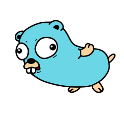

[](https://goreportcard.com/report/github.com/tlkamp/mockbob)

# mockbob



A CLI tool for generating Spongebob meme text.

Because sometimes manually typing out that format takes too many braincells.

## Demo


## Usage

> Note: Stdin takes precedence over argument provided values

To use `mockbob`, simply call it in your terminal.

```shell
$ mockbob herpaderp
hErPaDeRp
```

For multiple words, use quotes:

```shell
# Arg
$ mockbob do you even lift bro
dO yOu EvEn LiFt BrO

# Stdin
$ echo do you even lift bro | mockbob
dO yOu EvEn LiFt BrO
```

`mockbob` will preserve punctuation:

```shell
# Arg
$ mockbob 'do you even lift bro?'
dO yOu EvEn LiFt BrO?

# Stdin
$ echo 'do you even lift bro?' | mockbob
dO yOu EvEn LiFt Bro?
```

And if you want to start off with capital letters, pass the `-c` flag.

```shell
# Arg
$ mockbob -c "do you even lift bro?"
Do YoU eVeN lIfT bRo?

# Stdin
$ echo "do you even lift bro?" | mockbob -c
Do YoU eVeN lIfT bRo?
```

## Installation

To install this module, simply run:

```console
$ go install github.com/tlkamp/mockbob@latest

# mockbob is now available in your terminal
$ which mockbob
/Users/traci/go/bin/mockbob

$ mockbob -h
mockbob will take any set of input text, and return it in a Spongebob meme mocking format.

Examples:
  mockbob "do you even lift bro" -> dO yOu EvEn LiFt BrO
  mockbob -c "do you even lift bro" -> Do YoU eVeN lIfT bRo
  mockbob herpderp -> hErPdErP
  mockbob -c herpderp -> HeRpDeRp
  mockbob -r herpaderp ->HerPAdErP

Usage:
  mockbob [word or sentence] [flags]

Flags:
  -h, --help          help for mockbob
  -r, --random-caps   randomize the capital letters through the text
  -c, --start-caps    start the text with a capital letter
```
